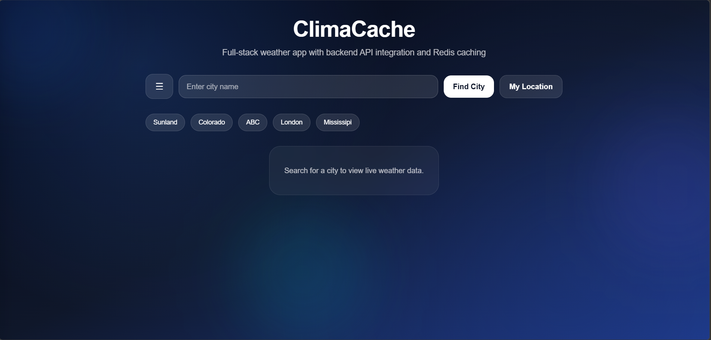
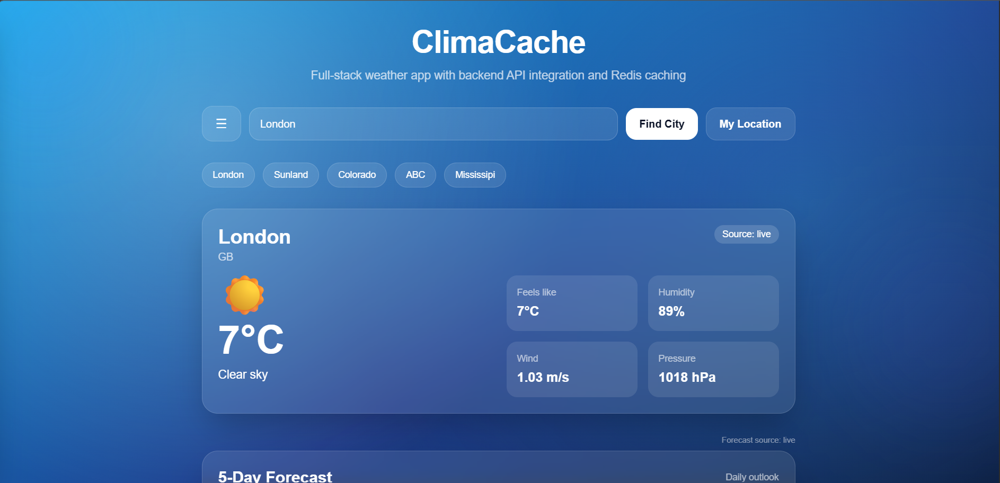
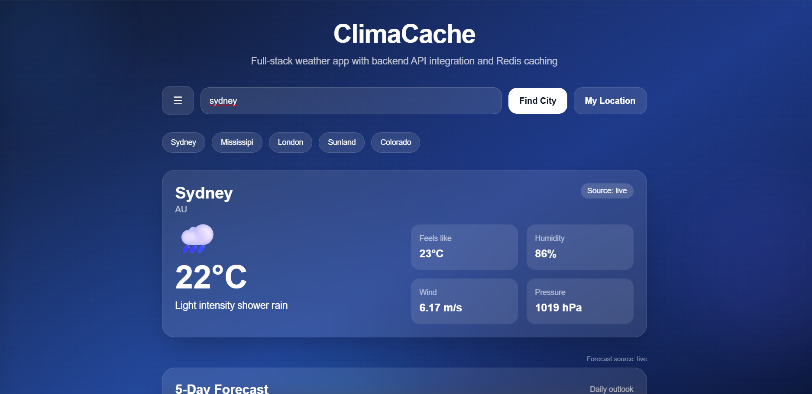
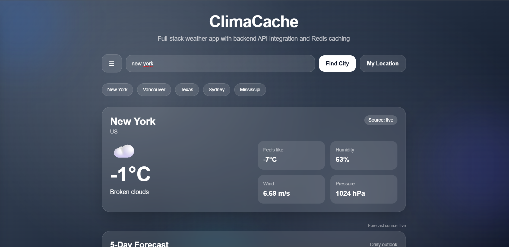
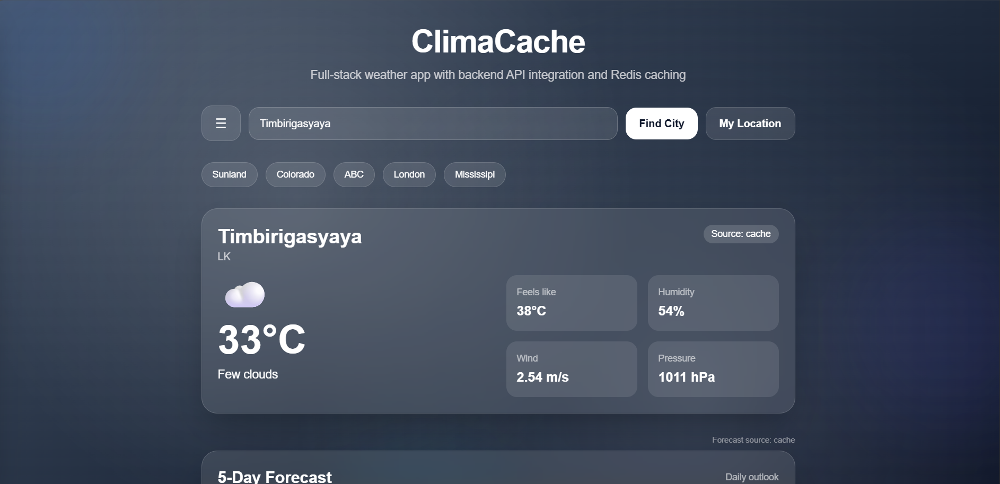
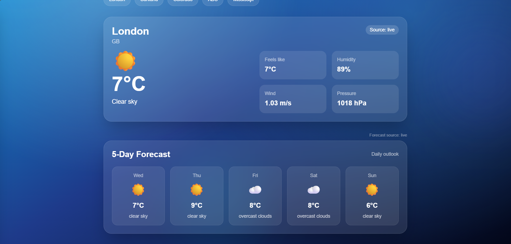
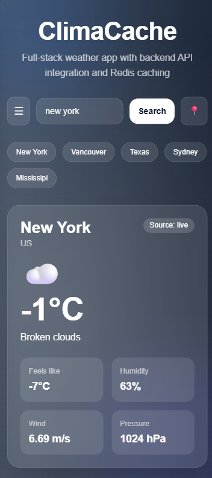
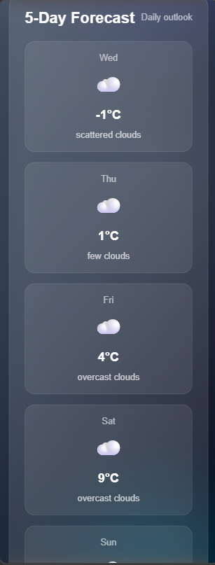

# 🌦️ ClimaCache

A full-stack weather application built with modern web technologies, featuring real-time weather data, Redis caching, and a dynamic UI that adapts visually based on weather conditions.

---

## 🚀 Features

- 🌍 Search weather by city
- 📍 Get weather using your current location
- ⚡ Redis caching (faster repeated requests)
- 📊 5-day weather forecast
- 🎨 Dynamic background based on weather conditions
- 💾 Recent searches saved using localStorage
- ⚙️ Customizable units (temperature, wind, pressure)
- 📱 Fully responsive (mobile + desktop)

---

## 🖼️ Screenshots

### 🏠 Home Page

This is the main interface of the application where users can search for cities, view current weather conditions, and interact with all core features. The UI is designed to be clean, responsive, and visually dynamic.



---

### 🌤️ Dynamic Weather UI (City-Based)

#### 🇬🇧 London — Clear Sky (Blue Theme)

The UI dynamically changes to a bright blue gradient representing clear sky conditions.



---

#### 🇦🇺 Sydney — Rain (Dark Rainy Theme)

A deeper blue-toned background appears to reflect rainy conditions.



---

#### 🇺🇸 New York — Scattered Clouds (Grey Theme)

The UI adapts to a muted grey gradient for cloudy weather.



---

### 📍 My Location Feature

Automatically fetches and displays weather based on the user's current location, providing instant real-time weather updates without manual input.



---

### 📊 5-Day Forecast

Displays a detailed 5-day forecast for the selected city, allowing users to plan ahead with high and low temperatures and weather conditions.



---

### ⚙️ Settings Sidebar

Users can customize how weather data is displayed:

- 🌡️ Temperature units (°C / °F)
- 💨 Wind speed units (m/s, km/h, mph)
- ⚙️ Pressure units (hPa, mbar, atm)

All changes are instantly reflected across the entire application, improving usability and personalization.


---

### 📱 Mobile Experience

Fully responsive design ensures smooth usability across devices.

#### 📱 Mobile View 1

Clean and compact layout optimized for smaller screens.



---

#### 📱 Mobile View 2

Adaptive UI elements and interactions for mobile usability.



---

## 🛠️ Tech Stack

### Frontend

- React (Vite)
- Tailwind CSS

### Backend

- Node.js
- Express.js

### API & Services

- OpenWeather API
- Upstash Redis

---

## ⚡ How It Works

- First request → fetched from API (**source: live**)
- Repeated request → served from Redis (**source: cache**)

This improves performance and reduces unnecessary API calls.

---

## 📦 Installation

### 1. Clone the repository

```bash
git clone https://github.com/pamina-guru/climacache.git
cd climacache
```
